# Engineering_4_Notebook
My Engineering 4 notebook

## Hello Python 

### Description 
  In this assignment we make a python code that if you click enter gives you a random number 1 to 6 and if you click x and enter it quits the application.

### Lessons Learned 
  In this assignment I reacquainted myself with python commands and terminal commands. Like how you end functions with colon's and that strings are str. I also learned that else ifs are elif. I learned that nano is how to edit a file and if you only have reading access you can use sudo nano. I learned that "python3 file name" runs the code in that file. Also during my creation of the the file I miss named it so I also learned that using "rm file name" you can remove files.

### Images and Links
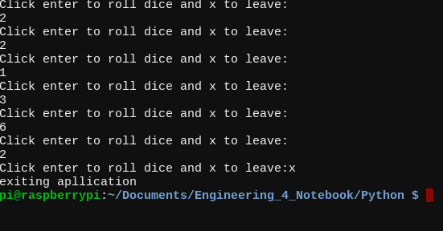
 

## Calculator

### Description
  In this assignment we make a python code that asks for two integers to be inputted by the user.
    
### Lessons Learned 
  In this assignment I learned how to def functions by using "def function name():" and any parameters you need you can put in the parantheses. I also learned that the round function is simply just "round(math function, number of digits to round)". Also I learned that I had to return my integer answer as a string to print it. 
  
### Images and Links
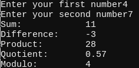

## Quadratic Solver

### Description
  In this assignment we make a code that finds out if there are roots of a quadratic with 3 user inputted coefficients and if there are roots it finds them and puts them into an array and prints them. 
    
### Lessons Learned 
  In this assignment I learned how to make a array/list by setting a variable = []. I learned the command variable.append(number) this adds a number or string to the list at the end. I learned that the ** is the math operator for an exponent. I also learned the raspberry pi command sudo shutdown -h now which will shut down the raspberry pi.
### Images and Links
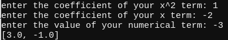

## Strings and Loops

### Description
  In this assignment we make a code that gets a user inputted sentence that gets turned into a list by characters and printed one by one
    
### Lessons Learned 
  In this assignment I learned how to replace certain parts of a string using string.replace("whatever I want replaced", "what I want to replace it"). I also learned setting a string equal to a list by doing string = list(string) will make it list seperated by letter.
### Images and Links
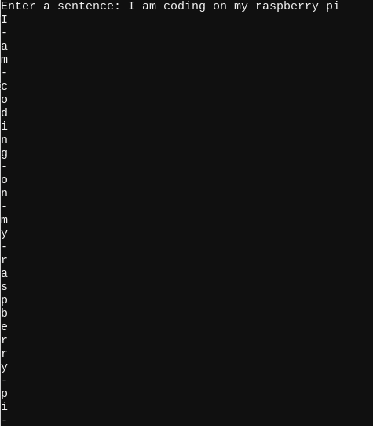

## MSP(Hangman)

### Description
  This assignment is to create a hangman program which prompts for a user inputted word then prints something out for every wrong letter guess.
    
### Lessons Learned 
  In this assignment I used a lot of similar commands from previous mainly involving a lot of lists. I learned the way to open and read text files in python which var = (file_name.txt, "r") then var.read() will read the file. I also learned to enumerate to keep track of all instances of a guess in the word that is being guessed using enumerate(list). I aslo learned "".join(list) which when put in print function will turn a list into a string when using quotations. I already knew this but it's the first time I've used it this year in coding so I thought I'd include that the break command simply ends a loop and simply requires typing the word break wherever in a loop you want it to break.
### Images and Links
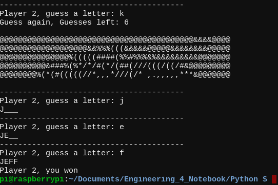
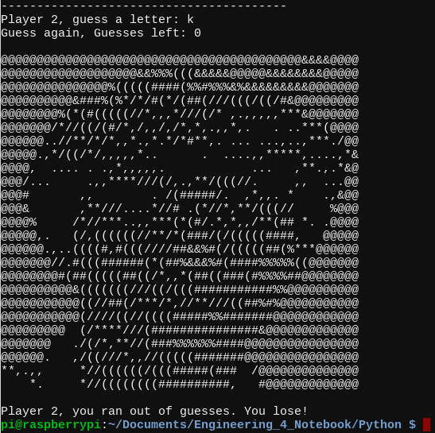

## SSH LED Blinking

### Description
  In this assignment we connect to our pi to our computer using the wifi by getting our pi's ip address and since I'm on computer I used Secure Shell
  
### Lessons Learned 
  In this assignment I learned how to turn my pi's ssh on "sudo raspi-config" and going to interface options and SSH. I also learned that how you connect is simply making the username pi since that's your login for the pi and the hostname is the ip address. I've used these before but time.sleep(how long you want to wait) is how you wait.
  
### Images and Links
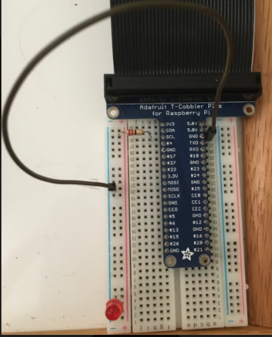

## I2C

### Description
  in this [assignment](https://github.com/lhange42/Engineering_4_Notebook/blob/main/Python/I2C.py) I had to use an accelerometer and a OLED display to display the changing acceleration of x,y, and z values using I2C to transfer the data from the accelerometer to the display. 
  
### Lessons Learned 
  I learned a lot of new things in this assignment. I learned a lot of new display commands. The example codes were actually really helpful for learning commands and seeing the different functions I can use. Also in the assignment is shows that the accelerometer returns six values since it includes a magnetometer so you have to set up a variable just to hold those mag values so you can seperate them. 
  
### Images and Links

## Headless

### Description
  in this [assignment](https://github.com/lhange42/Engineering_4_Notebook/blob/main/Python/Headless.py) I had to use my acceleromter and OLED display but now to make some kind of visual displaying one of the accelerations and get the to automatically happen on the pis boot up without you running the code directly.
  
### Lessons Learned 
  In this assignment I learned a couple new things not many new commands though since it's very similar to I2C. In my assignment I made scatter plot by having my x-axis represent time and I would increase it with each run trhough of the while loop. My y-axis represented the x acceleration it stayed at 17 to 22 for the acceleration when at rest so I set up a mathmatecal function to make it roughly zero. I already knew this but this is the first time I've used it I believe but I used the abs() command which takes the absolute value.
  
### Images and Links
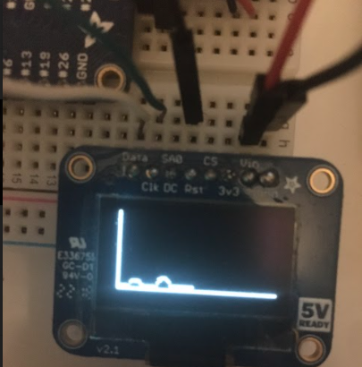
This Link: https://www.youtube.com/watch?v=us0utDJ7s1M&feature=youtu.be is a video showing the OLED Display graph. The change is hard to see but it's still visible.

## Bash

### Description
   In this [assignment](https://github.com/lhange42/Engineering_4_Notebook/blob/main/Python/bash.sh) we used bash to make two leds blink
  
### Lessons Learned 
  I learned how to use bash and a few commands. I learned that echo is the command to print. I learned you need #!/bin/bash at the start of a bash script. Also to be able to run a bash script you need to chmod +x file name to be able to run it. To do rests you simply type sleep put a space then just put the time wanted. I also learned for loops which you can see how to do in my code.
  
## GPIO Pins Python

### Description
   In this [assignment](https://github.com/lhange42/Engineering_4_Notebook/blob/main/Python/GPIO_Pins_Python.py) we used bash to make two leds blink with gpio
  
### Lessons Learned 
  This assignment was pretty much bash but obviously in python. This assignment will create weird errors if not managed by a line that says GPIO.setwarnings(false). I've used GPIO.BCM when setting mode of GPIO this time I used GPIO.BOARD which changes the how you call the pins in your code.
  
### Images
  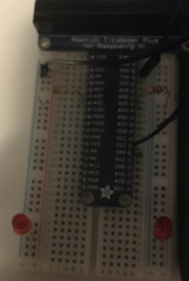

## Flask Hello World

### Description
  in this [assignment](https://github.com/lhange42/Engineering_4_Notebook/blob/main/Python/Flash/hello_world/app.py) you have to make a program that allows you to open a web browser and search your pi's ip and make it display hello world
  
### Lessons Learned 
  This assignment was pretty straight forward and provided a good basic understanding on how it works. It shows how to setup a web server. All you have to do is google the ip and you'll be able to access the pi's web server from anywhere.
  
### Images and Links
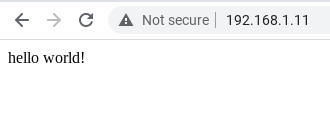

## GPIO Flask

### Description
   In this [assignment](https://github.com/lhange42/Engineering_4_Notebook/blob/main/Python/Flask/gpio/app.py) you use flask and HTML to set up a web server in where you put two buttons one to turn an LED on and one to turn an LED off.
  
### Lessons Learned 
  This assignment was pretty difficult. It made me remember some of the HTML stuff I learned in AP CSP. It was a little confusing because if you mess up one name of your variable then you just get a lot of errors and have to figure out which variable is incorrect. I learned a lot of commands like requests and also there is a lot of HTML formatting I learned.
  
### Images
  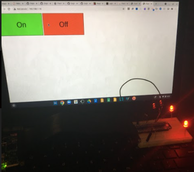
  
## Pi Camera
  
### Camera Test 1

#### Description
   In this [assignment](https://github.com/lhange42/Engineering_4_Notebook/blob/main/Pictures/camera_test01.py) I had to take a picture using the camera and print an indicator before and a completion indicator after.
  
#### Lessons Learned 
  In this assignment I learned how to do the basic setup for a camera. I learned how to setup the camera's resolution with the camera.resolution() before doing this command and the following you need to make sure that you make picamera.PiCamera() as camera. Finally you can use camera.capture('file name') to take a picture and it will save it in that folder under the name provdied in the apostrophes.
  
#### Images and links
  This [Link](https://github.com/lhange42/Engineering_4_Notebook/blob/main/Pictures/camera_test.jpg) is the picture taken
  
### Camera Test 2
  
#### Description
   In this [assignment](https://github.com/lhange42/Engineering_4_Notebook/blob/main/Pictures/camera_test02.py) I had to take 5 different pictures with different photo effects.
  
#### Lessons Learned 
  This assignment wasn't too bad. It contains the majority of the same commands and code. In this assignment instead I used a for loop to get the 5 pictures and a series of if and elif commands to cycle through the the different camera affects. The command camera.image_effect = 'effect' is how you change the effect that the camera is using. The effects we used were cartoon, colorswap, none(normal), sketch, washhedout.
  
#### Images and links
   This [Link](https://github.com/lhange42/Engineering_4_Notebook/blob/main/Pictures/camera_test_cartoon.jpg) is the cartoon effect picture
   
   This [Link](https://github.com/lhange42/Engineering_4_Notebook/blob/main/Pictures/camera_test_colorswap.jpg) is the colorswap effect picture 
   
   This [Link](https://github.com/lhange42/Engineering_4_Notebook/blob/main/Pictures/camera_test_none.jpg) is the normal picture
   
   This [Link](https://github.com/lhange42/Engineering_4_Notebook/blob/main/Pictures/camera_test_sketch.jpg) is the sketch effect picture
   
   This [Link](https://github.com/lhange42/Engineering_4_Notebook/blob/main/Pictures/camera_test_washedout.jpg) is the washedout effect picture
  
